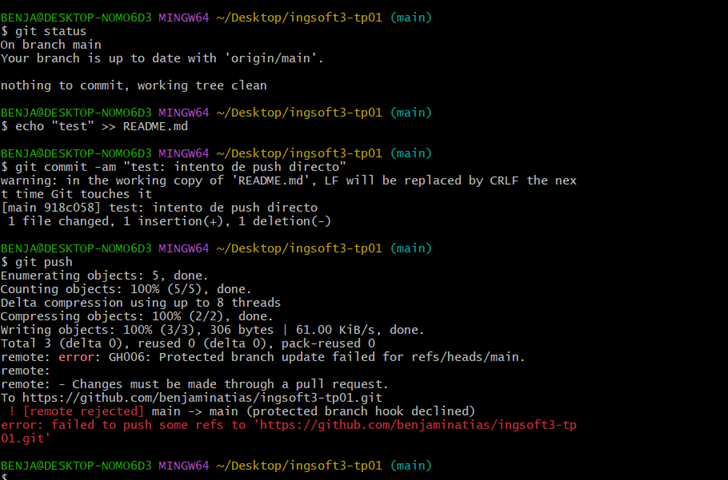
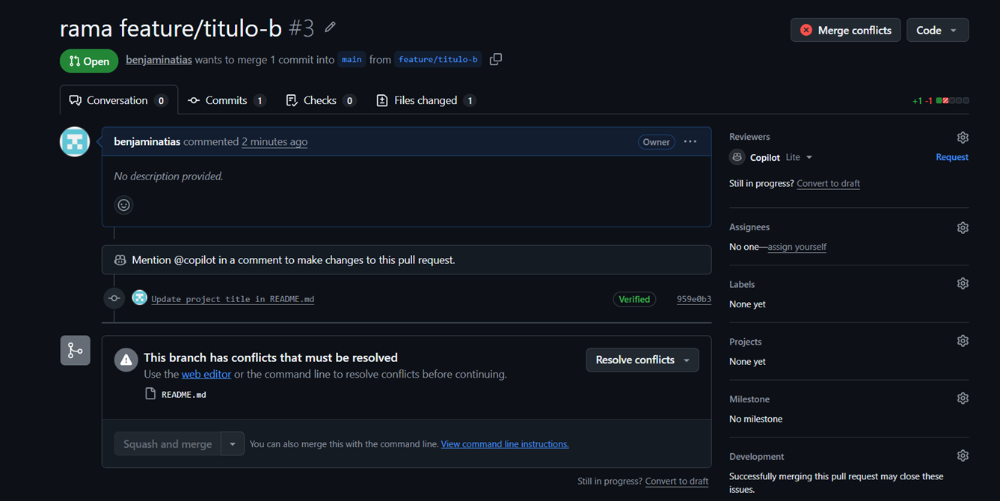
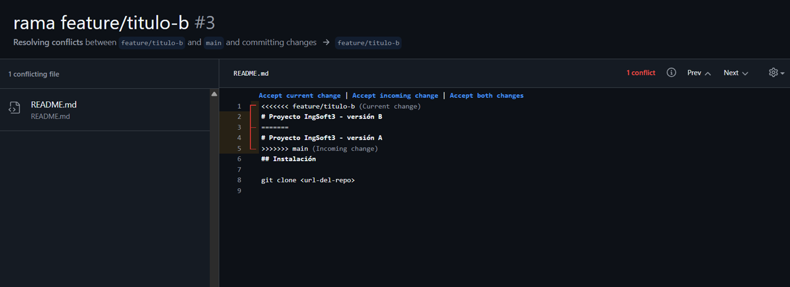
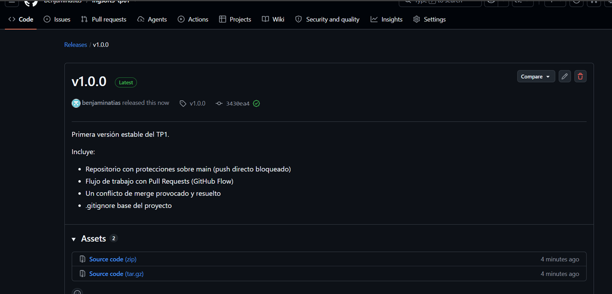
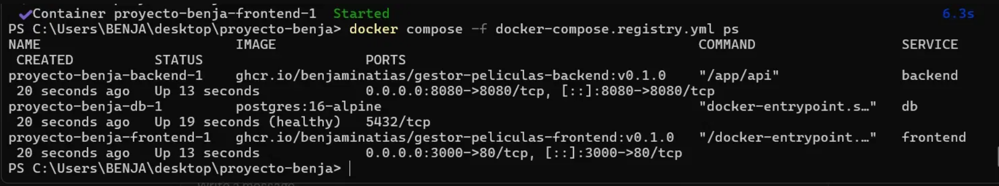
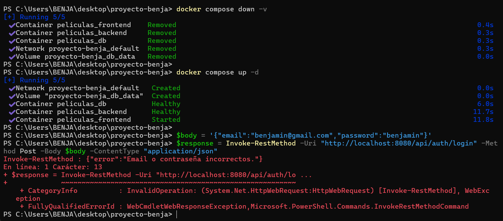
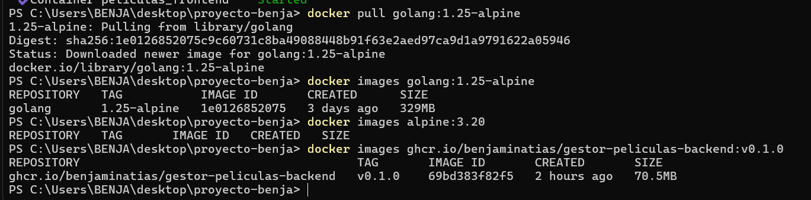
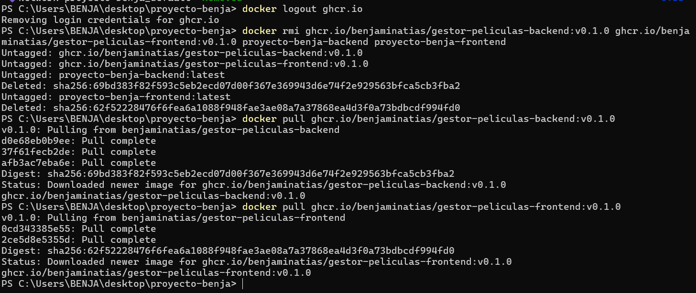

# Evidencias

## TP1 — Git colaborativo

## 1. Push directo a main rechazado

GitHub rechaza el intento de push directo a `main` porque la rama está protegida
y la regla "Do not allow bypassing" alcanza también al administrador del repositorio
(en este caso, yo mismo). El error muestra `protected branch hook declined`, confirmando
que ni siquiera el dueño del repo puede saltear la protección.

## 2. El PR de la rama B no se puede mergear: conflicto

Al crear el Pull Request de la rama `feature/titulo-b`, GitHub avisa que no se puede
mergear automáticamente porque hay conflictos con `main`. Esto ocurre porque la rama A
(ya mergeada) y la rama B modificaron la misma línea del `README.md` a partir del mismo
punto de partida, y Git no puede decidir cuál versión es la correcta.

## 3. Marcadores del conflicto

Al abrir "Resolve conflicts" en el PR de la rama B, se muestran los marcadores de Git
que delimitan el conflicto: `<<<<<<<` marca el inicio de la versión de mi rama actual,
`=======` separa las dos versiones en disputa, y `>>>>>>>` marca el final de la versión
que ya está en `main`. Resolver el conflicto implicó decidir qué contenido conservar y

## 4. Release v1.0.0 publicada

La release `v1.0.0` publicada en GitHub, generada a partir del tag creado sobre `main`,
con las notas describiendo qué incluye esta primera versión estable del TP.

------------------------------------------------------------------------------------------

## TP2 — Contenedores

### 1. `docker compose up` funcionando end-to-end

Los tres servicios (`db`, `backend`, `frontend`) corriendo con `docker compose ps`, usando las
imágenes publicadas en el registry (`ghcr.io/benjaminatias/...`). `db` y `backend` en estado
`healthy`, `frontend` en `running` (no tiene healthcheck configurado). Confirma que el sistema
completo levanta con un solo comando, tanto en su variante de build local como en la de registry.

### 2. Prueba de persistencia: `down` conserva los datos, `down -v` los borra

Después de `docker compose down -v` y `docker compose up -d`, un intento de login con las
credenciales que había usado antes fue rechazado (`"Email o contraseña incorrectos"`). Esto confirma
que el flag `-v` no solo vació la tabla de películas, sino **todo** el volumen `db_data` — incluida
la tabla de usuarios. Un `down` sin `-v`, en cambio, conserva todos los datos: se verificó
consultando `/api/peliculas` con el token JWT después de un ciclo `down`/`up` y la película creada
previamente seguía apareciendo.

### 3. Comparación de tamaño: imagen final vs. imagen de compilación

- `golang:1.25-alpine` (imagen con el compilador completo de Go, usada en la etapa `build` del
  Dockerfile): **329 MB**
- `ghcr.io/benjaminatias/gestor-peliculas-backend:v0.1.0` (imagen final, solo el binario compilado
  sobre `alpine:3.20`): **70.5 MB**

La imagen final pesa menos de un cuarto que la imagen de compilación, porque el multi-stage build
descarta el compilador y todo el toolchain de Go antes de publicar la imagen — solo viaja el binario
ya compilado.

### 4. Imágenes publicadas y accesibles sin autenticación

Después de `docker logout ghcr.io` (sesión cerrada) y de borrar las imágenes locales, un
`docker pull` de `gestor-peliculas-backend:v0.1.0` y `gestor-peliculas-frontend:v0.1.0` descargó
ambas imágenes sin pedir credenciales — confirmando que quedaron publicadas con visibilidad pública
en GitHub Container Registry.
eliminar estos marcadores.
